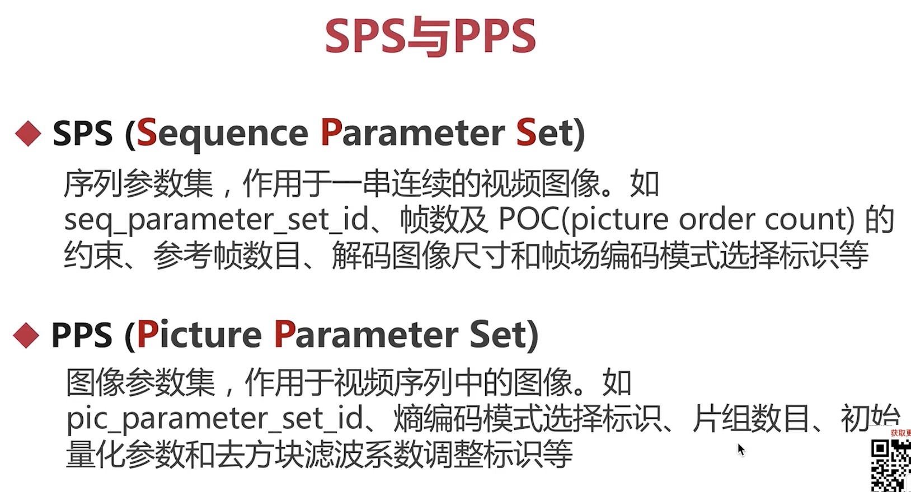
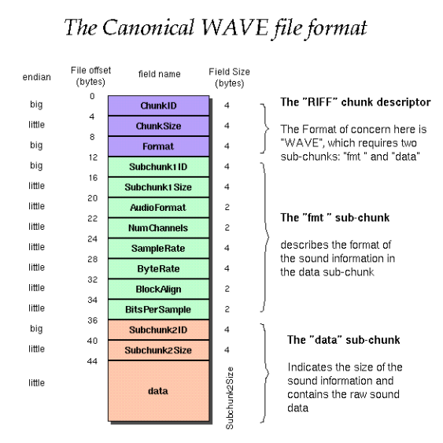
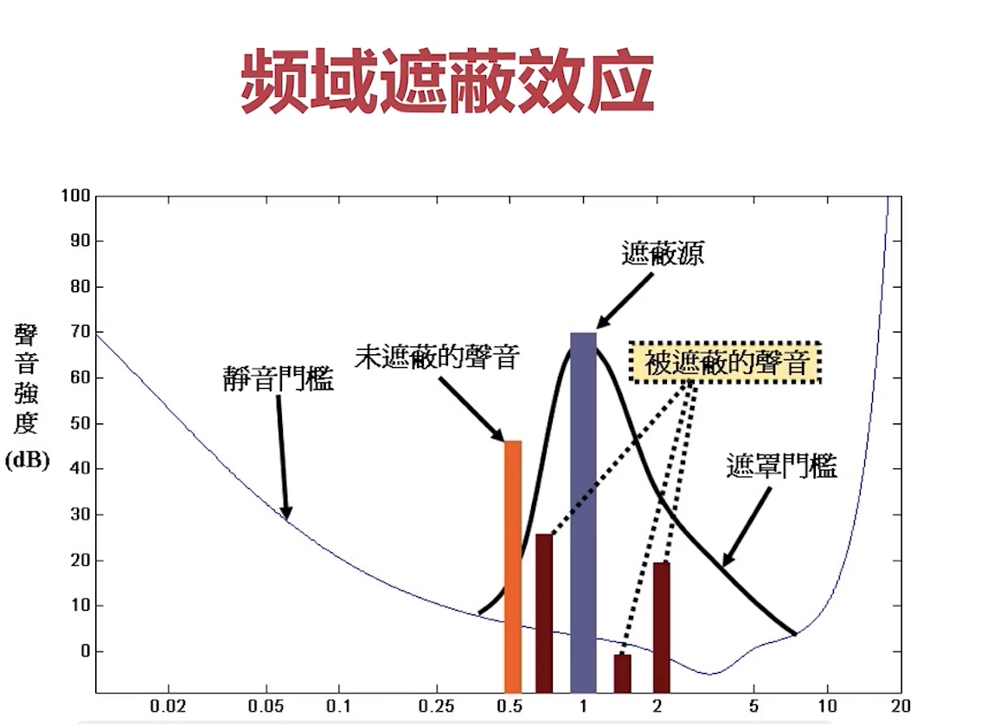

音视频开发
pcm编码
1字节=8比特
音频裸数据：pcm一段记录声音的数据，有采样率，声道数，量化格式，采样率乘以量化格式*2=比特率
采样率越高声音越清晰。空间越大
如果声音需要在网络进行传输就需要压缩和编码
常见的编码格式有
wav编码：基于pcm编码，前面多出44个字节，记录用来记录采样率，声道数，数据格式
mp3编码:对于128比特率的音质变现很不错，兼容性高。压缩比较高
aac编码：有损压缩。对小于128比特率的码率表现较好。一般用于视频中的音频编码
Ogg：支持情况较差，不考虑

图像编码
视频裸数据YUV
y表示亮度，uv表示色度，可以兼容黑白电视，当没有uv的时候就是黑白。
yuv通过矩阵转换变成rgb，根据使用标准不同，矩形也会不同

摄像头直接采集yuv数据转换为纹理

视频编码本质为
使用帧内编码技术可以去除空间上的冗余信息
使用帧间编码技术可以去除时间上的冗余信息

iso压缩编码为mepeg视频压缩标准
还有一种h.264编码压缩标准

每个画面就是一帧

i 帧叫做关键帧，可以直接解码

p帧是向前参考帧，需要依赖前面的帧进行解码

B帧是双向参考帧，需要参考前后解码的帧

帧可以分为ipb帧组成。i帧可以看成是一个图片经过压缩后的产物
俩个i帧之间形成一组图片，就是GOP。 gop_size越大，画面质量越高

每个gop的第一帧是idr帧，

idr是一种特殊的I帧

每次碰到idr帧，解码器会立即刷新，同时会清空解码器中参考buffer的内容

h264中还有俩个特殊的帧

sps 和pps

## 交叉编译基本工具链
CC、AS、 AR、LD、NM、GDB
CC:编译器，对C源文件进行编译处理，生成汇编文件
AS：将汇编文件生成目标文件
AR: 打包器，用于库操作。可以通过该工具从一个库中删除或者增加目标代码模块
LD：链接器，为前面生成的目标代码分配地址空间，将多个目标文件链接成一个库或者是可执行文件
GDB：调试工具
STRIP：以最终生成的可执行文件或者库文件作为输入，然后消除 掉其中的源码。
NM :查看静态库文件中的符号表。
·Objdump：查看静态库或者动态库的方法签名。

javac -h -jni TextMain.java，将生成.class以及-jni的文件夹里面就是TextMain.h文件。

ffmpeg
ffmpeg是进行媒体文件转码的命令行工具，ffprobe是用于查看媒体 文件头信息的工具，ffplay则是用于播放媒体文件的工具

ffmpeg编解码过程
av_register_all 注册编解码器，封账格式，注册协议
av_find_codec  寻找编码器，寻找解码器
avcodec_open2 打开编码解码器
avcodec_close  关闭编码解码器
avformat_open_input 判断文件的格式
avformat_find_stream_info  把所有Stream的MetaData信息填充好。方法内部会先查 找对应的解码器，然后打开对应的解码器，紧接着会利用Demuxer中的 read_packet函数读取一段数据进行解码
av_read_frame  返回一个 AVPacket结构体
avcodec_decode  解码视频，解码音频
avformat_close_input  责释放对应的资源
avformat_alloc_output_context2 找到对应的格式
avio_open2 

直播开发过程
第一部采集
音频采集  采样率 位宽 声道数 音频帧
图像采集  分辨率 采样频率 采集格式 传输通道
采集源  摄像头  屏幕录制  文件推流
视频采集通过camera的setPreviewcallback获取yuv原始数据
音频采集通过 mediaRecoder 获取pcm原始数据

第二部前处理
视频处理 美颜 滤镜 水印
音频处理  混音 降噪 特效

第三部分 编码和封装
编码的必要性 原始裸数据过大 网络传输困难
编码原理 去除空间冗余 时间冗余 编码冗余 视觉冗余

第四部分 推流
一般市场现在主要使用的推流协议就是rtmp协议
 它对于cdn支持良好 协议比较简单 网上开源项目较多
不支持网页的推流

webrtc 是w3c标准 基于udp 传输速度快 但是cdn支持较差

对于推流的优化可以是  保证音频的传输  调整码率 fps 分辨率 适当的调整可以加快传输速度

第五部分 服务端处理
转码 对不同的网络带宽，不同的终端处理能力和用户需求 提供不同的清晰度和转码能力
录制 截图  录制用来做回放 国家的要求 用来做点播 截图用来做封面
鉴黄

第六部分 客户端处理
拉流 rtmp拉流  http-flv hls 拉流协议
解码 硬解码和软解码 从音视频数据中提取原始数据 硬解码速度快 不会发热 但是需要适配不同的手机版本
渲染 音视频的同步 声音的播放 视频的显示

第七部分交互系统
聊天 礼物 连麦 

第八部分 工具测试类
推流工具 obs 
播放测试工具 cutv

## wav音频格式

## 音频压缩

消除冗余信息  有损压缩

1， 比如20hz以下20000Hz以上对于人来说不敏感的信号都可以清除

2，遮蔽信息 

​		1， 频域遮蔽（傅里叶变换）（根据频率和声高强弱进行遮蔽）

​		2,    时域遮蔽  

无损压缩

1，熵编码 

​	  哈夫曼编码（小二进制的代替长的字符）

​	  算术编码

​	  香农编码

## 图片压缩

H264压缩

帧内压缩

​		1.1，相邻像素差别不大，进行宏块预测（9种帧内预测模式 ），预测结束后生成的宏块和原图宏块进行对比生成残差值数据

​		1.2，亮度的敏感度超过色度

​		1.3,   yuv将亮度和色度分开

 

2，帧间压缩

​	gop之间进行压缩

​	参考帧

​	运动估计（宏块匹配+ 运动矢量）

​	运动补偿（解码）

整数离散，余弦变换，量化

CABAC压缩

宏块

视频压缩的基本单元